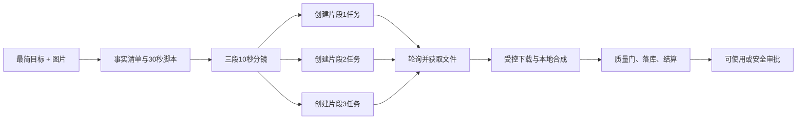

# 升级迭代架构说明

日期：2026-07-30

## 架构摘要

保留 Express、SQLite、React 和现有积分账本，不新增第三方依赖。通过两个既有边界完成升级：

1. 外部调用边界：所有真实 AI、搜索、OCR、Embedding 和媒体调用必须进入统一的权限、限流、占扣、结算与错误脱敏流程。
2. 员工执行边界：档案、能力、技能、提示词、工作配置和岗位契约合成为一次不可变执行上下文，手动与自动入口复用同一行为。

## 系统边界

- 浏览器只负责显示角色允许的入口，不承担安全授权。
- Express 路由负责认证、模块权限、角色范围和输入校验。
- 执行引擎负责员工上下文、外部调用和岗位输出。
- SQLite 负责业务记录、积分账本、审批和审计；不负责长期保存第三方明文密钥。
- Scheduler 必须由显式环境开关启用，默认不运行。

## 数据与状态

- 不做破坏性数据库迁移。
- 模板降级结果使用现有状态/模式字段表达“未完成”，不伪装 API 成品。
- 目标缺失使用 `rate=null` 和可解释状态，不以分母 1 计算。
- 员工输出契约在系统边界做严格类型、非空和最小数量校验。

## API 与契约

- 敏感接口以后端 401/403 为准。
- 错误响应只返回清洗后的用户可读消息。
- 员工执行上下文至少包括 model、outputLength、timeoutSeconds、webRequired、approval、abilities、skills、profileVersion 和 promptHash。
- `webRequired=true` 且未得到搜索证据时，运行不能进入正常完成状态。

## 跨切面关注点

安全与隐私：

- API Key 仅从进程环境或外部密钥服务读取。
- 日志、响应和数据库错误字段必须统一脱敏。
- 工具运行结果默认仅创建人、老板和管理员可见。

可观测性：

- 外部调用需要稳定 trace、provider、model、usage、cost、status 和 sanitized error。
- Scheduler 启停状态进入健康/管理状态。

兼容性：

- 先保留现有接口形状，新增 `completionState`、`rateStatus` 等解释字段时保持旧字段可安全渲染。
- 前端先兼容 `rate=null`。

## 能力盘点

- 已有两阶段计费：`server/src/credits.js` 与部分 AI 路由。
- 已有并发/速率限制：`server/src/ai-limits.js`，但覆盖模块不足且后台生命周期过早结束。
- 已有员工完整档案：餐饮员工工作台和内容员工工作台。
- 已有内容岗位契约：`content-output-contract.js`，需从 key 存在升级为严格结构。
- 已有调度器：`server/src/scheduler.js`，需显式启动门。
- 不新增依赖；沿用 Node 测试、Express 中间件和现有数据库封装。

## 被否方案

- 只改前端文案：不能修复权限、费用和真实执行。
- 一次重写所有 AI 路由：评审面过大，先建立骨架并按高风险入口迁移。
- 用更多真实调用验证：当前缺陷已经可复现，继续付费没有价值。

## 风险

- 历史测试可能依赖模板降级“done”语义。
- Scheduler 测试需要显式打开环境开关。
- 严格契约会暴露既有提示词输出不完整，需要补修生成提示与解析。

## 2026-07-31 角色任务闭环与 Quiet Command 增量

### 领域边界

- `content-approval` 是餐饮数字员工产出的唯一审核命令。审批中心与兼容路由只做鉴权、校验和协议转换，不能各自更新业务表。
- `task-transitions` 负责人工经营任务的合法转换、并发保护和审核审计。通用资料更新不能改变任务状态。
- 老板参谋的“转任务/转派分部”只创建可领取的人工管理任务；数字员工任务只能从真实岗位派活入口创建并由真实 worker 推进。
- `business-flow` 是只读投影，按权威外键组合来源、任务、运行、审批、内容、素材与资产，不承担写入和状态修复。

### 状态与一致性

```text
人工任务：待执行 -> 进行中 -> 待审核 -> 已完成
                         ^          |
                         |-- 驳回 --|

数字员工：生成中 -> 待审阅 -> 已完成 / 已驳回
                      |
                      +-> 唯一审核命令 -> 内容/审批/知识/资产同步
```

- 写入采用事务和条件更新；重复决定返回既有终态，不重复写知识或资产。
- 提交记录保存 `reviewer_id / reviewed_at / review_reason`，完成后重开必须记录操作者与理由。
- 历史演示库的不一致记录不静默批改；新增不变量测试和显式审计数量，修复迁移另行评审。

### 角色与数据投影

- `boss/admin/platform_super`：租户内全局任务、完整岗位内部档案、审核和穿刺。
- `ops_director/manager`：管理范围内派活、进度、结果与普通风险审核；不返回提示词、技能、配置和内部档案。
- `sales/staff/partner`：仅本人或授权范围的任务、提交与业务结果；不允许审核自己的数字员工产出。
- 浏览器隐藏只用于体验；所有边界以服务端角色、租户和人员范围查询为准。

### 前端壳层

- 默认两栏：可收起导航和主工作区；右侧助手使用按需 Drawer/Inspector。
- 命令面板承接全局检索与快捷动作，不再常驻底栏。
- 任务页面以“当前动作 + 结果 Artifact + 时间线/穿刺”为主，说明和内部档案退到二级层。
- 主题令牌统一画布、表面、文字、细线、动作色与状态色；只对顶部、命令层和检查器使用克制半透明效果。

### 安全、可观测与外部验收

- 云模型密钥只进入隔离测试进程环境；不写 SQLite、日志、截图、报告或仓库。
- 真实样本记录 `X-Request-Id`、角色、任务/运行/审批/内容/资产 ID、provider、model、`aiMode`、usage、hold/settlement 与输出哈希。
- 云验收停止条件：目标模型缺失、模板降级、契约无效、单次超过 120 秒、悬挂占扣、供应商生成调用超过 3 次、出现外部发布、Scheduler 或后台向量任务被启用。
- 没有轮换后的新测试密钥时，云样本保持明确阻塞；所有本地真实应用 API、数据库和浏览器验收继续执行。

## 2026-08-08｜免审策略、最简 Brief 与 AI 带货架构增量

### 审批策略 v2

- `approval_routing_policy` 升级为兼容读取 v1、写入 v2；数字员工 route 支持 `auto/risk_based/manager/boss`。
- `resolveApprovalRoute()` 返回 `requiresReview`、`autoAdopt`、`reason`、`steps`。免审时 `steps=[]`，调用方不得创建审批记录，必须执行同一领域服务的自动采纳分支。
- 自动采纳前统一通过：岗位输出契约、事实/来源、内部档案泄漏、风险分类、外部动作检测、费用结算状态。
- `highRiskOwnerReview`、`externalActionOwnerReview`、`paidActionOwnerReview` 为服务端硬编码真值，不进入可关闭配置。

### 最简任务编译器

- 输入 DTO：`goal`（唯一必填）、`attachments[]`、可选 `deadline/outputPreference`。
- `resolveEmployeeBrief()` 按优先级合并：用户明确事实 → 上传材料 → 门店/企业档案 → 授权知识库 → 最新联网/地图证据 → 岗位默认值。
- 输出 `resolvedBrief` 包含 `facts`、`assumptionsForbidden`、`knowledgeEvidence`、`webEvidence`、`toolPlan`、`outputPlan`、`missingCriticalFacts` 与字段级 provenance。
- 前端只发送最简 DTO；旧完整表单字段继续兼容，统一映射到编译器，避免破坏自动任务和历史客户端。

### 统一员工运行包

- 70 名既有员工执行器都从 canonical profile 装载全部必需字段；UI 是否展示不影响运行时装载。
- 技能目录对用户呈现 `owner_verified_enabled`，底层证据保留 `sourceSnapshot/fingerprint`；所有 required/owner-verified 技能默认注入。
- runtimeBindings 标准化为 `webPolicy`、`knowledgePolicy`、`apis`、`tools`、`connectors`，并保存 planned/attempted/succeeded/blocked 证据。

### 内容员工组合目录

- Paihuo `content-crew.json` 保持 10 岗不可变来源目录。
- `native-content-employees` 提供 idx=10 `commerce_video`，两者由组合 roster 暴露给内容仓；0–9 流水线仍只消费 Paihuo roster，单员工工作台和任务列表支持 0–10。
- AI 带货员 profile 同样满足 canonical 字段、老板侧七面板、最简派活、租户权限和运行证据要求。

### MiniMax 连接器与 30 秒编排



- Provider 接口封装为 `createVideoTask`、`getVideoTask`、`getFile`；传输层可注入，测试不联网。
- H3 路径使用 2×15 秒、`MiniMax-H3`、`/v2/video_generation`；已核价兼容路径使用 3×10 秒、`MiniMax-Hailuo-2.3-Fast/2.3`、v1 异步接口。模型、端点、分段与计价能力矩阵由服务端维护，不允许客户端任意拼接。
- 每段使用稳定 idempotency key；任务状态与 provider task id 持久化，进程重启可恢复轮询。H3 在官方套餐/当前代理价格未验证时只能进入待授权状态，不允许猜价占扣。
- 远端文件下载沿用公网地址、重定向、MIME、大小与 SSRF 防护；合成只读取已固化本地素材。
- 费用按分段预估、授权、占扣和实际结算；未授权时停在 `awaiting_paid_media_authorization`，脚本/分镜不受影响。
