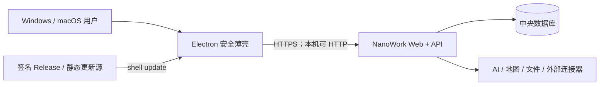

# NanoWork 桌面客户端架构

更新日期：2026-08-23

## 架构摘要

Electron 只承担安全窗口、连接配置、原生下载与桌面壳更新。业务 UI 和 API 由同一 NanoWork 服务 origin 提供，延续当前 BrowserRouter、`/api`、SSE 和 HttpOnly Cookie 契约。



## 系统边界

- `desktop/`：Electron 主进程、本地设置窗口、安全策略、更新和打包。
- `web/`：业务界面，由 NanoWork 服务端同源托管；不复制到 Electron 包。
- `server/`：鉴权、数字员工、内容、账务、文件与外部供应商；不进客户端。
- `desktop/release/`：本地可重生成产物，不作为源码。

## 状态流

1. 读取 `userData/desktop-config.json`；无文件则使用默认地址。
2. 规范化并验证 origin。
3. 创建 sandboxed BrowserWindow，加载 origin。
4. 加载失败时打开本地设置窗口；用户重试或更换 origin。
5. 保存成功后重载主窗口。
6. 当且仅当已打包、已配更新 URL 且签名条件成立时检查壳更新。

## 本地配置与 IPC

```json
{
  "schemaVersion": 1,
  "serverUrl": "http://127.0.0.1:3107",
  "updatedAt": "ISO-8601"
}
```

- 原子写入 Electron `userData`；只存 origin，不存账号、密码、Cookie、token 或业务响应。
- 设置 IPC 只提供读设置、检查服务、保存服务和重试四个字段化动作。
- 所有 handler 核对 `event.senderFrame.url` 为打包内本地设置页，远程页面不能调用。

## 安全与隐私

- `nodeIntegration:false`、`contextIsolation:true`、`sandbox:true`、`webviewTag:false`、`webSecurity:true`。
- 远程主窗口不配 preload；本地设置窗口只暴露字段化 API。
- 全部 permission request 默认拒绝；未来如需摄像头/麦克风，按 origin + permission 精确开放。
- 只允许主 frame 导航到当前 origin；外部 URL 只允许无凭据 HTTPS，交系统浏览器。
- 不关闭 TLS 验证、webSecurity 或证书错误；远程 HTTP 硬拒绝。
- 打包文件使用 allowlist，不包含 `server/`、`.env`、SQLite、uploads、artifacts 或用户数据。

## 可观测性与兼容

- “关于”显示客户端版本、Electron/Chromium 版本和平台，不显示凭据。
- 服务端继续使用现有 `X-Request-Id` 和运行证据。
- 无业务数据迁移；本地配置带 `schemaVersion`，发布版本使用 semver，两平台同版号。

## 依赖策略

- Electron：提供一致 Chromium runtime，直接兼容当前 React/Web/SSE/Cookie。
- electron-builder：生成 DMG/ZIP/NSIS/Windows ZIP 和更新 metadata。
- electron-updater：使用 electron-builder metadata 实现 Windows/macOS 桌面壳更新。
- 依赖放在独立 `desktop/package.json`，不污染根包和 Web/server 依赖树。

## 被否掉的方案

- 内嵌后端/SQLite：会把密钥与业务数据带到终端，并产生重复调度、重复计费和数据不一致。
- `file://` 打包 Web：现有 BrowserRouter、根资源、`/api`、Cookie、CORS/CSRF 契约均要重写，且业务 UI 不能即时同步。
- Tauri：当前无 Rust toolchain，又会引入 WebView2/WKWebView 差异；不抵消薄壳体积收益。

## 风险

- 当前无域名：包默认连本机服务，不等于可独立连接生产。
- 当前无签名证书：macOS Gatekeeper 和 Windows SmartScreen 会对内测包警告。
- 在 macOS 上不能充分证明 Windows NSIS 运行；必须使用 Windows runner 构建和冒烟。
- 远程运行 Web 会放大 XSS 后果；因此客户端绝不向远程页面暴露任何原生能力。
